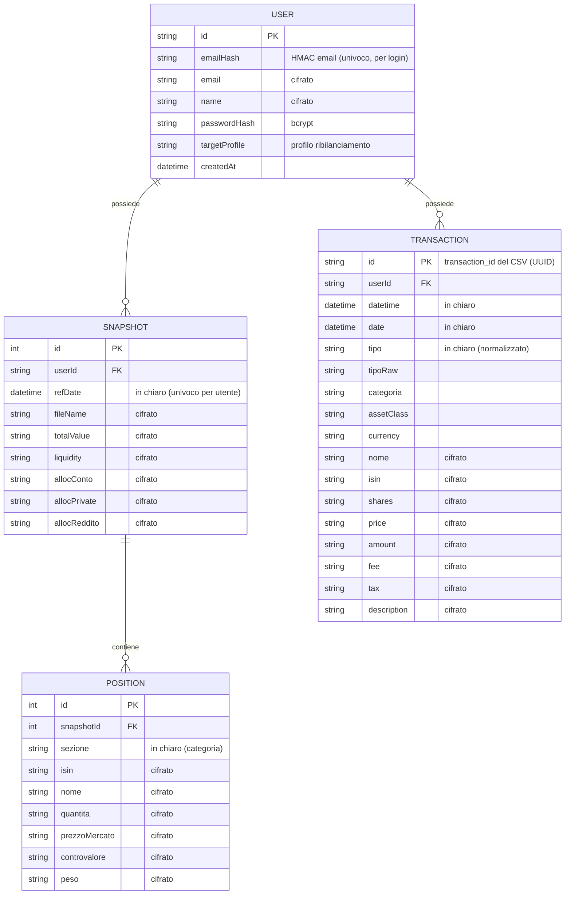

# Portfolio Dashboard

Dashboard web (Next.js) **multi-utente** che replica e amplia i fogli Excel di
analisi del patrimonio Trade Republic: ti registri, accedi, carichi gli estratti
**PDF** e il **CSV** delle transazioni dal browser. Il parsing avviene lato
server, i dati — isolati per account e **cifrati a riposo** — vengono salvati in
**PostgreSQL**, e tutte le metriche (prezzo di carico, plus/minus, diversificazione,
valutazione) sono ricalcolate a runtime.

---

## Funzionalità

- **Account** — registrazione, login e logout. Password con hash bcrypt, sessione
  JWT in cookie httpOnly, rotte protette via middleware. Ogni utente vede solo i
  propri dati.
- **Cifratura a riposo** — i dati sensibili sono cifrati nel database con
  AES-256-GCM (vedi sezione *Sicurezza*).
- **Panoramica** — KPI patrimoniali, asset allocation, controvalore per titolo,
  andamento mensile cumulato e flussi (dividendi/interessi/commissioni).
- **Posizioni** — posizioni dell'ultimo estratto, con prezzo di carico medio
  (dal CSV), plus/minus latente e peso %.
- **Diversificazione** — ripartizione per area geografica, settore e asset class
  con *look-through* degli ETF (composizioni indicative degli indici), indici di
  concentrazione (HHI, posizioni effettive), punteggio di diversificazione e
  valutazione testuale. Arricchimento opzionale via API esterna **OpenFIGI** per
  identificare strumenti sconosciuti (best-effort, con fallback locale).
- **Valutazione** — "health check" del portafoglio su 8 dimensioni
  (diversificazione, allocazione vs profilo, costi/TER, concentrazione, liquidità,
  performance, disciplina, reddito passivo), con punteggio complessivo e un piano
  d'azione prioritizzato di consigli pratici di finanza personale.
- **Ribilanciamento** — confronto dell'allocazione attuale con un profilo target
  (Prudente/Bilanciato/Dinamico) e importi suggeriti da spostare. Il profilo
  scelto è salvato sul tuo account nel database.
- **Transazioni** — registro completo normalizzato, ricercabile e filtrabile,
  con plus/minus realizzata a costo medio ponderato.
- **Calcolatore** — valutazione interattiva di obbligazioni (YTM lordo/netto) ed
  ETF (CAGR netto, impatto dei costi).
- **Carica dati** — upload drag&drop di PDF/CSV, con import idempotente.
- **Impostazioni** — cambio password, esportazione dei dati (CSV/JSON) ed
  eliminazione dell'account.

## Stack tecnologico

| Ambito | Tecnologia |
|---|---|
| Framework | Next.js 14 (App Router, React 18, TypeScript) |
| Stile | Tailwind CSS (design system custom), font Inter + Sora |
| Grafici | Recharts |
| Database | PostgreSQL 16 (via Docker) |
| ORM | Prisma 5 |
| Auth | JWT (jose) in cookie httpOnly + bcrypt |
| Parsing | `pdf-parse` (PDF), `papaparse` (CSV) |
| Crittografia | Node `crypto` — AES-256-GCM + HMAC-SHA256 |
| API esterna | OpenFIGI (classificazione strumenti, opzionale) |

---

## Prerequisiti

- [Node.js](https://nodejs.org) 18.18+ (consigliato 20+)
- [Docker](https://www.docker.com/) con Docker Compose

## Avvio rapido

```bash
# 1. Avvia il database Postgres (e Adminer su http://localhost:8081)
docker compose up -d

# 2. Configura l'ambiente: copia il file e imposta i segreti
cp .env.example .env
# in .env imposta AUTH_SECRET e ENCRYPTION_KEY, es: openssl rand -base64 32

# 3. Installa le dipendenze (genera anche il client Prisma)
npm install
npx prisma generate

# 4. Crea/aggiorna le tabelle nel database
npm run db:push

# 5. Avvia l'app
npm run dev
```

Apri **http://localhost:3000**: verrai indirizzato al **login**. Crea un account
da **Registrati**, poi vai su **Carica dati** e trascina i tuoi PDF e il CSV.

> Nota: `AUTH_SECRET` ed `ENCRYPTION_KEY` sono obbligatori. In sviluppo è presente
> un valore di default; in produzione impostane di casuali e segreti.

## Comandi utili

| Comando | Descrizione |
|---|---|
| `docker compose up -d` | Avvia Postgres + Adminer |
| `docker compose down` | Ferma i container (i dati restano nel volume) |
| `docker compose down -v` | Ferma e **cancella** i dati del database |
| `npm run db:push` | Sincronizza lo schema Prisma col database |
| `npm run db:studio` | Apre Prisma Studio per ispezionare i dati |
| `npm run dev` | Avvia in modalità sviluppo |
| `npm run build && npm start` | Build e avvio in produzione |

---

## Struttura del progetto

```
portfolio-dashboard/
├── app/
│   ├── (app)/                 # area protetta (richiede login)
│   │   ├── page.tsx            # Panoramica
│   │   ├── posizioni/
│   │   ├── diversificazione/
│   │   ├── valutazione/
│   │   ├── transazioni/
│   │   ├── calcolatore/
│   │   ├── carica/
│   │   └── impostazioni/
│   ├── (auth)/                 # login / registrazione
│   └── api/
│       ├── auth/               # register, login, logout
│       ├── account/            # password, export, profile, delete
│       └── upload/             # import PDF/CSV
├── components/                 # Sidebar, Charts, tabelle, form…
├── lib/
│   ├── parsing/pdf.ts          # parser estratti PDF
│   ├── parsing/csv.ts          # parser transazioni CSV
│   ├── analytics.ts            # costo medio, plus/minus, sintesi, statistiche
│   ├── diversification.ts      # ripartizioni + indici + punteggio
│   ├── classify.ts             # look-through ISIN → area/settore/asset class
│   ├── healthcheck.ts          # valutazione su 8 dimensioni
│   ├── crypto.ts               # AES-256-GCM + blind index
│   ├── auth.ts / jwt.ts        # autenticazione e sessione
│   └── data.ts                 # accesso dati + decifratura + calcoli
├── prisma/schema.prisma
├── middleware.ts               # protezione rotte
└── docker-compose.yml
```

---

## Schema E/R

Tre entità di dominio collegate all'utente. `Position` dipende da `Snapshot`; tutto
viene eliminato in cascata con l'utente.



Vincoli principali: `User.emailHash` univoco; `Snapshot(userId, refDate)` univoco;
`Position(snapshotId, isin)` univoco. I campi cifrati sono `String` (base64 del
ciphertext AES-256-GCM); i campi "in chiaro" restano tali perché servono a
ordinamento, raggruppamento e filtri e non sono sensibili.

Le metriche derivate (prezzo di carico medio, plus/minus, sintesi mensile,
statistiche, diversificazione, valutazione) **non** sono salvate: vengono
ricalcolate a runtime a partire dai dati grezzi decifrati.

---

## Importazione dati (PDF e CSV)

L'upload (drag&drop in *Carica dati*) invia i file a `POST /api/upload`, che li
processa **lato server** in base all'estensione. Il flusso è:

```
file → /api/upload → riconoscimento .pdf / .csv
     → parsing (pdf-parse / papaparse)
     → cifratura campi sensibili (AES-256-GCM)
     → UPSERT su Postgres (idempotente, per utente)
```

### Estratti PDF (`lib/parsing/pdf.ts`)

1. `pdf-parse` estrae il testo dell'estratto "Estratto del patrimonio netto".
2. Si individua la **data di riferimento** (`al giorno gg.mm.aaaa`), la tabella di
   sintesi (controvalore totale, liquidità, allocazione per categoria) e le
   **posizioni** delle sezioni *Conto Titoli / Private Markets / Reddito Fisso*
   (ISIN, nome, quantità, prezzo di mercato, controvalore, peso %).
3. I numeri in formato italiano (`12.483,57`) sono convertiti in `number`.
4. Persistenza: un PDF crea/aggiorna **uno `Snapshot`** identificato da
   `(utente, data di riferimento)`; le sue `Position` vengono ricreate.

### Transazioni CSV (`lib/parsing/csv.ts`)

1. `papaparse` legge l'export "Transaction export" (separatore virgola, decimali
   con punto).
2. Ogni riga è normalizzata: il `type` grezzo (BUY, SELL, DIVIDEND,
   INTEREST_PAYMENT, …) è mappato a un tipo leggibile (Acquisto, Vendita,
   Dividendo, Interesse, Versamento, …); date e numeri sono tipizzati.
3. Persistenza: ogni transazione è salvata con `upsert` sulla chiave `id`
   (= `transaction_id` del CSV, un UUID univoco).

### Idempotenza (niente duplicati)

L'import è **idempotente e incrementale**:

- ricaricare lo stesso CSV **non crea duplicati**: le transazioni con lo stesso
  `transaction_id` vengono aggiornate, non reinserite;
- caricare un export più recente aggiunge **solo** i movimenti nuovi;
- ricaricare il PDF dello stesso mese **sovrascrive** lo snapshot invece di
  duplicarlo (chiave `utente + data di riferimento`).

`DELETE /api/upload` svuota i dati dell'utente corrente (per ricominciare da zero).

---

## Sicurezza

- **Password**: mai salvate in chiaro, solo hash **bcrypt**.
- **Sessione**: JWT firmato (HS256) con `AUTH_SECRET`, in cookie httpOnly/SameSite.
- **Cifratura a riposo**: i campi sensibili sono cifrati con **AES-256-GCM**
  (IV casuale + tag di autenticazione per ogni valore) usando una chiave derivata
  da `ENCRYPTION_KEY`. Vengono cifrati: email e nome utente; importi, prezzi,
  quantità, commissioni, tasse, ISIN, nome titolo e descrizione delle transazioni;
  valori, liquidità e allocazione degli snapshot; ISIN/nome/quantità/prezzi delle
  posizioni. Restano in chiaro solo dati non sensibili e necessari a query/ordinamento
  (date, tipo operazione, valuta, categoria).
- **Lookup email**: l'email è cifrata (non ricercabile direttamente); per il login
  si usa un *blind index* HMAC-SHA256 deterministico (`emailHash`).

> ⚠️ `ENCRYPTION_KEY` e `AUTH_SECRET` vanno tenuti segreti e **non vanno cambiati**
> dopo il primo utilizzo: cambiandoli, i dati già cifrati e le sessioni non saranno
> più leggibili. Conservali in modo sicuro (es. secret manager) in produzione.

## Note

Le valutazioni del calcolatore e della pagina *Valutazione* sono stime educative a
scopo informativo, basate su euristiche di finanza personale e sui dati caricati;
**non costituiscono consulenza finanziaria** personalizzata.
